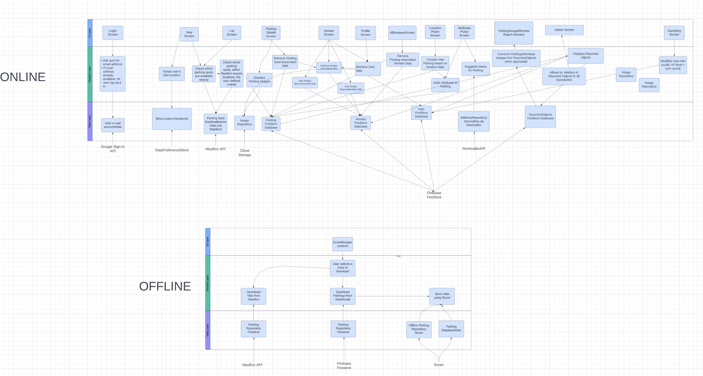

# Cyrcle - The Bike Companion

Cyrcle is a community-driven app designed to solve the everyday challenges faced by cyclists.  
Our mapping system helps you find the perfect parking spot for your bike, ensuring that your 
two-wheeled companion is always safe well-stored.

## Features

- **Parking Spots**: Find the nearest parking spot for your bike.
- **Community**: Share your experiences and help others by adding new parking spots and repair stations.
- **Profile**: Keep track of your contributions and earn rewards.
- **Offline Mode**: Use the app even when you're offline.
- **Where's my bike**: Never forget where you parked your bike again.

## Resources

### Architecture

### External resources

- [Figma Design](https://www.figma.com/design/glKpOCnBOjzx8mTTJUkyqH/Cyrcle?node-id=4-2&t=axZO6k6pPJuiWDin-1)
- [Documentation](https://github.com/SwEnt-Fall-2024-Group-22/Cyrcle/wiki/Documentation)

## Tech stack

- Language: Kotlin
- Testing
  - Espresso - UI Testing
  - JUnit - Unit Testing
  - Mockk - Mocking
  - Robolectric - Android Testing
- CI Tools
  - GitHub Actions
- Dependency Injection
  - Dagger Hilt
- Design
  - Figma
