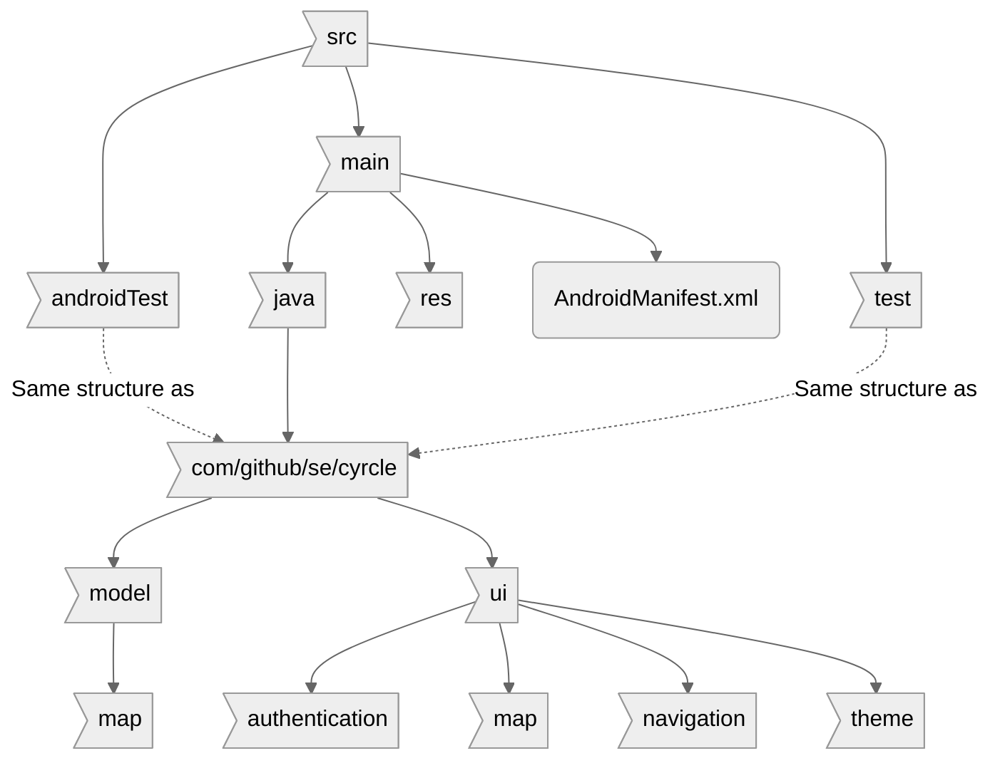
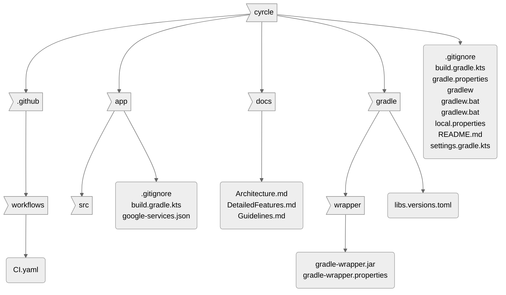

# Architecture

## Source code

```mermaid
---
config:
    theme: neutral
    fontFamily: helvetica
---
flowchart TB
    SRC>src] --> ANDROID_TEST>androidTest] 
    SRC --> MAIN>main]
    SRC --> UNIT_TEST>test]
    
    ANDROID_TEST -.Same structure as.-> C_GH_SE_CYRCLE>com/github/se/cyrcle]

    MAIN --> RES>res]
    MAIN --> SRC_files(AndroidManifest.xml)
    MAIN --> JAVA>java]
    JAVA --> C_GH_SE_CYRCLE
    
    UNIT_TEST -.Same structure as.-> C_GH_SE_CYRCLE

    C_GH_SE_CYRCLE --> MODEL>model]
    C_GH_SE_CYRCLE --> UI>ui]
    
    MODEL --> MODEL_MAP>map]
    
    UI --> UI_AUTH>authentication]
    UI --> UI_MAP>map]
    UI --> UI_NAV>navigation]
    UI --> UI_THEME>theme]
```

## Project from above the `src` directory

The following directory tree should represent the basis of the whole project

```mermaid
---
config:
    theme: neutral
    fontFamily: helvetica
---
flowchart TB
    root>cyrcle] --> GTH>.github]
    root --> APP>app]
    root --> DOC>docs]
    root --> GRA>gradle]
    root --> root_files(.gitignore\n build.gradle.kts\n gradle.properties\n gradlew\n gradlew.bat\n gradlew.bat\n local.properties\n README.md\n settings.gradle.kts)
    
    GTH --> WF>workflows]
    WF --> WF_files(CI.yaml)
    
    APP --> SRC>src]
    APP --> APP_files(.gitignore\n build.gradle.kts\n google-services.json)
    
    DOC --> DOC_files(Architecture.md\n DetailedFeatures.md\n Guidelines.md)
    
    GRA --> WRP>wrapper]
    WRP --> WRP_fils(gradle-wrapper.jar\n gradle-wrapper.properties)
    GRA --> GRA_files(libs.versions.toml)
```

## Legend

```mermaid
---
config:
    theme: neutral
    fontFamily: helvetica
---
flowchart TB
    A>Directory]
    B(Files)
    C[\TO BE DEFINED\]
```