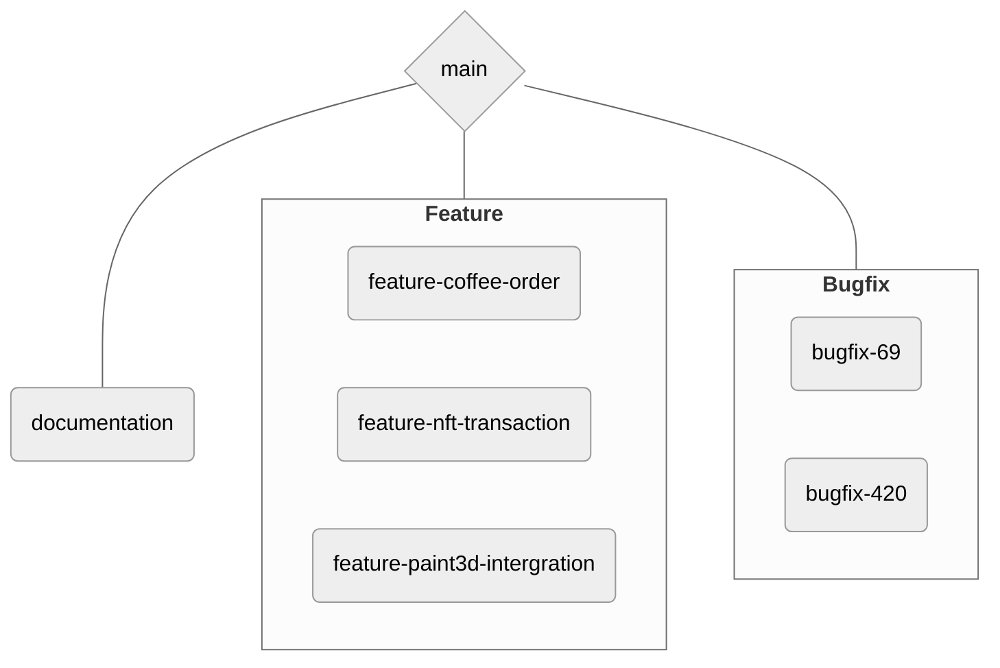

# Guidelines

## Git

### Commits

Commit will follow the *advanced* guidelines of
```
type (opt. scope) : description

optional body

optional footers
```

With the example
```
feat(api): add user registration endpoint

Added a new endpoint for user registration, including validation and database persistence.
Closes #56
```

#### Types

- `arch` for major architecture modification
- `dev` for small architecture improvement
- `feat` for feature development
- `fix` for fixes
- `track` for time tracking
- `refactor` for code refactor
- `doc` for documentation (both in code and user documentation)
- `cicd` for CI/CD modification
- `misc` for what doesn't have a category

### Branches

The default branch is `main`. From it originate
-  **feature for feature development**\
  Each new feature should originate from it, with the name `feature-<FEATURE_NAME>`, where 
  `<FEATURE_NAME>` is a shortcut name for the feature (for example `coffee-order` if the feature add
  the possibility to order a coffee)
-  **bugfix for bug fixing**\
  When a new bug is found, the branch for it should be named `bugfix-<ISSUE_NR>`, where `<ISSUE_NR>`
  is the issue number on GitHub.
-  **documentation for documentation changes/improvement**\
  A more miscellaneous branch for documentation enhancement (modifying `README.md`, ...). It 
  should be pretty low usage, so no need for deeper branch, as the modification should be quick, 
  small pushes.

#### General view



### Oh Shit, Git!?!
This part is based on the website [ohshitgit](https://.ohshitgit.com), but with the solution for 
people in this project

- **I want to update my branch to main (as if I just branched from the last commit)**
  ```
  git checkout MY_BRANCH
  git rebase main
  # Solve potential conflicts
  git push -f origin MY_BRANCH  
  ```
  The last line is useful to update the remote branch, because the history will be different once 
  rebasing.\
  **NOTE** :  The two first lines can be done with JetBrains IDEs GUI.

- **I forgot something in my last commit, but making a new commit would be ugly/nonsensical**
  - In JetBrains IDEs, you can simply check the box "Amend" above the commit message input field. It
    will provide you with the overview of your previous commit, with the selected changes you would
   like to add. If you already pushed on the remote repository, you might want to `git push -f 
   origin MY_BRANCH`, and if inside a Pull Request, don't forget to rerun the CI job.
  - With the terminal 
  ```
  git commit --amend
  git push -f origin MY_BRANCH
  ```

  - **Multiple people working on a branch**\
    That's a bad idea. Best is to further subdivide the branch into two branches, and to merge/rebase
    them from time to time, while communicating about it (recall only the `main` branch is protected 
    and hence accidents can happen). To avoid the maximum conflict, you should work on different 
    files. The ideal way would be to create empty functions in your files, then to branch, and to
    finally merge everything together, but that can be quite hard as function signatures may change.\
    Here is a example graph of what should happen.
    ```mermaid
    ---
    config:
    theme: neutral
    fontFamily: helvetica
    ---
    flowchart TB
    main{main} -...-> main_end{main}
    main --> fa((c))
    
    subgraph feature-A-2
    fa2((c)) ==> fa2A((c)) ==> fa2B((c)) ==> fa2C((c)) ==> fa2end((c))
    end
    fa ==> fa2
    
    subgraph feature-A
    fa((c)) --> faA((c)) --> faB((c)) --> faC((c)) --> faD((c)) --> fa_end((c))
    end
    
    subgraph feature-A-1
    fa1((c)) ==> fa1A((c)) ==> fa1B((c)) ==> fa1C((c)) ==> fa1end((c))
    end
    fa ==> fa1
    
    fa_end ==Pull request==> main_end
    fa1end ==> fa_end
    fa2end ==> fa_end
    
    fa2 -.merge.-> faA
    fa1A -.-> faB
    fa2B -.-> faC
    fa1C -.-> faD
    ```
    Of course, only merges are shown in this graph, but be assured that `rebase` is also allowed
    here. If this helps you, the branch `feature-A` can be seen as un unprotected `main` (without
    protection), so be sure that the communication between the multiple workers is efficient so that
    no one `-f` his/her way into it.

## GitHub

### Pull Request

- If the PR only contains one commit (some quick fix), it can be left as is
- For a consequent PR, please set all the fields on the right of the screen
  - 2 reviewers
  - 1 assignee (yourself)
  - The labels, if any applicable
  - The project (Cyrcle), with a status if any
  - The current milestone
  - Issues linked with the PR.

### Review Process

- On the reviewer's machine
  1. Pull the code
  2. Run the unit tests
  3. Test the UI in the emulator.
- On GitHub
  1. Review the code with in-document comments
  2. In the general review, precise failed results (if any) of unit tests, and the result of your UI
    test (don't forget to mention your Emulator model)

## Inside the code

Android Studio, as it is based on JetBrains IDE, support comment highlights for specified strings 
(tags), such as `TODO`s. Those tags can be specified in `File > Settings > Editor > TODO`
Please not also that, on the bottom left (by default), under the "Build" tab lays an dotted 
hamburger menu : it can display all the tags that you defined in the "TODO" menu.

Those tags should not appear in the repo (at least on the `main` branch), as they indicate that the
code isn't working.

### TODO Tags

#### TODO
For work that needs to be done, not yet implemented

#### FIXME
It doesn't work

#### XXX
It works, but I don't know how

#### OPTIMIZATION
Something could be optimized

#### QUESTION
A question to ask the course staff

### Code beauty
In a file, please stay within 80-, 100-, or 120 character length. Choose one and stay consistent
within a file.
