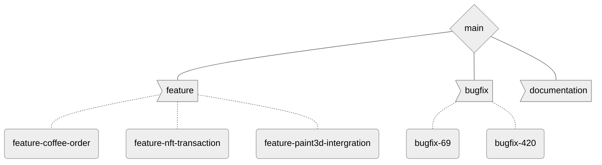

# Guidelines

## Git

### Commits

Commit will follow the *advanced* guidelines of
```
type (opt. scope) : description

optional body

optional footers
```
With the example
```
feat(api): add user registration endpoint

Added a new endpoint for user registration, including validation and database persistence.
Closes #56
```
#### Types

- `arch` for major architecture modification
- `dev` for small architecture improvement
- `feat` for feature development
- `fix` for fixes
- `track` for time tracking
- `refactor` for code refactor
- `doc` for documentation (both in code and user documentation)
- `cicd` for CI/CD modification
- `misc` for what doesn't have a category

### Branches

The default branch is `main`. From it originate
-  **`feature` feature development**\
  Each new feature should originate from it, with the name `feature-<FEATURE_NAME>`, where 
  `<FEATURE_NAME>` is a shortcut name for the feature (for example `coffee-order` if the feature add
  the possibility to order a coffee)
-  **`bugfix` for bug fixing**\
  When a new bug is found, the branch for it should be named `bugfix-<ISSUE_NR>`, where `<ISSUE_NR>`
    is the issue number on GitHub.
-  **`documentation` for documentation changes/improvement**\
  A more miscellaneous branch for documentation enhancement (modifying `README.md`, ...). It 
  should be pretty low usage, so no need for deeper branch, as the modification should be quick, 
  small pushes.

#### General view



## GitHub

### Review Process

- On the reviewer's machine
  1. Pull the code
  2. Run the unit tests
  3. Test the UI in the emulator.
- On GitHub
  1. Review the code with in-document comments
  2. In the general review, precise failed results (if any) of unit tests, and the result of your UI
    test (don't forget to mention your Emulator model)

## Inside the code

Android Studio, as it is based on JetBrains IDE, support comment highlights for specified strings 
(tags), such as `TODO`s. Those tags can be specified in `File > Settings > Editor > TODO`
Please not also that, on the bottom left (by default), under the "Build" tab lays an dotted 
hamburger menu : it can display all the tags that you defined in the "TODO" menu.

Those tags should not appear in the repo (at least on the `main` branch), as they indicate that the
code isn't working.

### TODO Tags

#### TODO
For work that needs to be done, not yet implemented

#### FIXME
It doesn't work

#### XXX
It works, but I don't know how

#### OPTIMIZATION
Something could be optimized

#### QUESTION
A question to ask the course staff

### Code beauty
In a file, please stay within 80-, 100-, or 120 character length.
